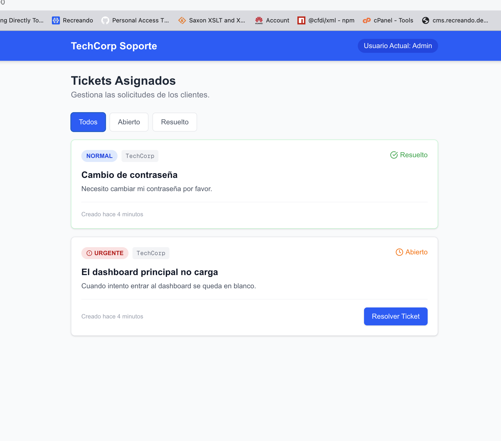
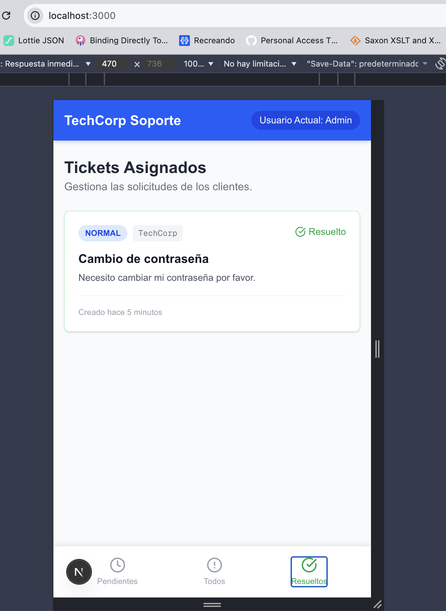

# Coding Challenge: Soporte TechCorp 🚨

¡Hola! Gracias por aplicar. Para esta prueba técnica, queremos simular un escenario real de nuestro día a día. No hay requerimientos abstractos, sino un problema real de soporte que debes resolver.

Se evaluará tu capacidad para:
- Entender código existente (Node.js, React/Next.js, Tailwind).
- Utilizar herramientas de IA (Claude, Cursor, Gemini, etc.) para acelerar tu diagnóstico y resolución.
- Priorizar tareas críticas bajo presión.
- Mantener el orden y las buenas prácticas al corregir bugs.

## El Contexto

Acabas de iniciar tu día y recibes el siguiente mensaje por Slack de José (Project Manager):

> **De:** José
> **Para:** Equipo de Soporte
> 
> "Hola chicos, buenos días. Les paso contexto de unos inconvenientes urgentes que tenemos en la plataforma de TechCorp. Austin (del cliente) me indica que no puede ingresar a resolver los tickets desde su celular, el botón de 'Resolver' simplemente no le hace nada. 
>
> Además, al parecer están teniendo que recargar toda la página para ver cuando un ticket cambia de estado. Es un tema urgente porque las personas de soporte de ellos no pueden gestionar los casos marcados como 'Urgente', dicen que el sistema se queda cargando y nunca termina. Ya estoy creando los tickets en Jira.
> 
> Y por último, y esto es lo más crítico: me acaban de confirmar que un usuario pudo ver los tickets de OTRA empresa. Necesitamos revisar qué está interfiriendo ahí con la base de datos o el servicio, no podemos tener esa fuga de datos.
>
> Me confirman cuando lo tengan listo para coordinar pruebas finales con ellos. Mil gracias."

## Tu Misión

1. Clona este repositorio e instala las dependencias (`npm install`).
2. Levanta la base de datos local poblada de prueba (`npm run db:setup`) y el servidor (`npm run dev`).
3. Identifica y resuelve los 4 problemas mencionados por José en su mensaje.
4. Sube tu código a un repositorio público (GitHub/GitLab) y envíanos el enlace.

**Nota:** Tienes total libertad de usar herramientas de IA para apoyarte. Lo que nos importa es cómo analizas el problema, cómo guías a la IA y la calidad de la solución final. ¡Éxitos!

---

## Solución

### Bugs resueltos

Cada bug fue corregido en un commit independiente con mensaje descriptivo:

| # | Bug | Causa raíz | Fix | Commit |
|---|-----|-----------|-----|--------|
| 1 | Botón "Resolver" no funciona en móvil | El footer fijo (`fixed bottom-0 z-50`) cubría el último ticket, haciendo el botón intocable | Agregar `pb-24` al contenedor principal para dejar espacio debajo del footer | `fix(mobile)` |
| 2 | La página requiere recarga para ver cambios de estado | Mutación directa del array de state: `tickets[i] = x; setTickets(tickets)` — React no detecta cambio por ser la misma referencia | Usar `setTickets((prev) => prev.map(...))` para crear un nuevo array inmutable | `fix(state)` |
| 3 | Tickets "Urgente" se quedan cargando infinitamente | `sendEmailNotification()` retorna una Promise que nunca llama `resolve()`, bloqueando el `await` en el PATCH | Agregar `resolve()` dentro del callback de la Promise | `fix(api)` |
| 4 | Fuga de datos: usuario ve tickets de otra empresa | El endpoint GET no filtra por `companyId`, retorna todos los tickets de la BD | Filtrar por `companyId` en GET **y** validar ownership en PATCH (retornando 404, no 403, para no revelar existencia del recurso) | `fix(security)` |

### Feature adicional: Filtros por estado

Los tabs del footer móvil ("Pendientes" / "Resueltos") eran puramente decorativos y en desktop no existía ningún mecanismo de filtrado. Se implementó:

- **Mobile:** Footer funcional con 3 tabs (Pendientes / Todos / Resueltos) que filtran tickets por estado
- **Desktop:** Tabs de filtro visibles arriba de la lista de tickets
- Mensaje vacío contextual según el filtro seleccionado

#### Desktop

#### Mobile

